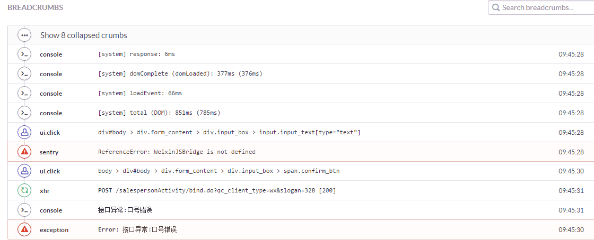

## 移动调试和异常监控

#### 移动调试

移动端调试开发环境可以用chrome模拟设备，如果是微信公众号的开发可以使用[微信web开发者工具](https://mp.weixin.qq.com/debug/wxadoc/dev/devtools/download.html)

相关的调试方法可参考下面这两篇文章：[移动端前端开发调试](http://yujiangshui.com/multidevice-frontend-debug/)、[各种真机远程调试方法汇总](https://github.com/jieyou/remote_inspect_web_on_real_device)

大家常用的真机调试方式，以安卓机为例：数据线+chrome://inspect 或者 Weinre 

这里向推荐：WechatFE出品的 [vConsole](https://github.com/WechatFE/vConsole)，同类型的产品还有 [eruda](https://github.com/liriliri/eruda)

vConsole的 [演示地址](http://wechatfe.github.io/vconsole/demo.html)

手机预览  


调试只在测试环境使用，正式发布环境要把调试控制台去掉：  
创建build/build-publish.js和build/build-test.js:
```
 let fileTxt = `let publish = true
export default publish`

  require('fs').writeFile(require('path').join(__dirname, '../src/modules/js/vconsoleConfig.js'), fileTxt)
```
src/modules/js/common.js:
```
// 开发环境调试面板，上线时屏蔽
import publish from './vconsoleConfig.js'
if (!publish) {
  require('vconsole')
}
```

script命令调整如下：
```
  "scripts": {
    "dev": "node build/dev-server.js",
    "build-publish": "node build/build-publish.js && node build/build.js && node build/zip.js",
    "build": "node build/build-test.js && node build/build.js && gulp upload",
    "upload": "gulp upload"
  },
```

#### 异常监控
采用 [sentry](https://sentry.io) 系统平台，需要创建Team和Project
查看官方文档，找到 [集成vue](https://docs.sentry.io/clients/javascript/integrations/vue/) 的文档，登录以后就可以选择相应的Team/Project，会自动生成一个配置地址和对应的代码，复制到项目下即可


如果要收集额外的异常，可如下处理：
```
import Raven from 'raven-js'

Raven.captureException(new Error('some message'))
```

异常列表：  


异常详情：  


更多使用请参考 [官方文档](https://docs.sentry.io/) 

> 本系列文章：

1. <a href="https://github.com/tonyfree/blog/issues/1" target="_blank">基础结构的搭建</a>
2. <a href="https://github.com/tonyfree/blog/issues/2" target="_blank">postcss插件和css预编译配置</a>
3. <a href="https://github.com/tonyfree/blog/issues/3" target="_blank">路径别名和模块自动加载配置</a>
4. <a href="https://github.com/tonyfree/blog/issues/4" target="_blank">rap自动切换配置</a>
5. <a href="https://github.com/tonyfree/blog/issues/5" target="_blank">自动化部署</a>
6. <a href="https://github.com/tonyfree/blog/issues/6" target="_blank">移动端适配方案</a>
7. <a href="https://github.com/tonyfree/blog/issues/7" target="_blank">UI库的选择和使用</a>
8. <a href="https://github.com/tonyfree/blog/issues/8" target="_blank">移动调试和异常监控</a>