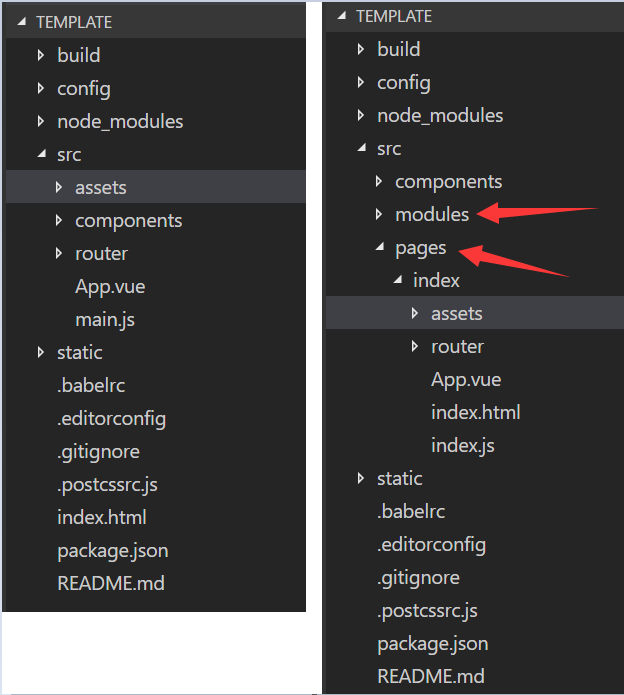

1.全局安装[vue-cli](https://github.com/vuejs/vue-cli)：Vue.js官方提供的用于快速创建项目模板的脚手架工具
```
$ npm install -g vue-cli
```

2.创建[项目模板](https://github.com/vuejs-templates)：官方提供了五个模板--webpack、webpack-simple、browserify、browserify-simple、simple，选择当下最火的构建工具webpack模板
```
$ vue init webpack project-name
```

3.在安装过程中会有一些提示：  
1)Vue build这个选项选择Runtime + Compiler  
2)安装vue-router，ESLint、Karma+Mocha、Nightwatch根据需求选择安装


3)根据提示操作，即可成功启动项目

4.现在创建的项目模板是单页面应用，与多页面应用还有些差别，需要做一些调整：   
1)项目目录结构的调整：  
  
在开发路径src下增加modules和pages文件夹，分别存放模块和页面   
有关页面的所有文件都放到同一文件夹下就近管理：index.html(页面模板)、main.js(页面入口文件)、App.vue(页面使用的组件，公用组件放到components文件夹下)、router(页面的路由配置)、assets(页面的静态资源)都移到index文件夹下，并把main.js改为index.js,保证页面的入口js文件和模板文件的名称一致  

2)在build/utils.js中添加两个方法：webpack多入口文件和多页面输出
```
var path = require('path')
var glob = require('glob')
var HtmlWebpackPlugin = require('html-webpack-plugin')
var PAGE_PATH = path.resolve(__dirname, '../src/pages')
var merge = require('webpack-merge')

//多入口配置
exports.entries = function() {
  var entryFiles = glob.sync(PAGE_PATH + '/*/*.js')
  var map = {}
  entryFiles.forEach((filePath) => {
    var filename = filePath.substring(filePath.lastIndexOf('\/') + 1, filePath.lastIndexOf('.'))
    map[filename] = filePath
  })
  return map
}

//多页面输出配置
exports.htmlPlugin = function() {
  let entryHtml = glob.sync(PAGE_PATH + '/*/*.html')
  let arr = []
  entryHtml.forEach((filePath) => {
    let filename = filePath.substring(filePath.lastIndexOf('\/') + 1, filePath.lastIndexOf('.'))
    let conf = {
      template: filePath,
      filename: filename + '.html',
      inject: true
    }
    if (process.env.NODE_ENV === 'production') {
      conf = merge(conf, {
        minify: {
          removeComments: true,
          collapseWhitespace: true,
          removeAttributeQuotes: true
        },
        chunksSortMode: 'dependency'
      })
    }
    arr.push(new HtmlWebpackPlugin(conf))
  })
  return arr
}
```

3)修改build/webpack.base.conf.js的入口配置
```
module.exports = {
  entry: utils.entries(),
...
```

4)修改build/webpack.dev.conf.js和build/webpack.prod.conf.js的多页面配置：把原有的页面模板配置注释或删除，并把多页面配置添加到plugins  
webpack.dev.conf.js：
```
  plugins: [
    ......
    //  new HtmlWebpackPlugin({
    //    filename: 'index.html',
    //    template: 'index.html',
    //    inject: true
    //  }),
    ......
  ].concat(utils.htmlPlugin())
```
webpack.prod.conf.js：
```
  plugins: [
    ......
    // new HtmlWebpackPlugin({
    //   filename: config.build.index,
    //   template: 'index.html',
    //   inject: true,
    //   minify: {
    //     removeComments: true,
    //     collapseWhitespace: true,
    //     removeAttributeQuotes: true
    //   },
    //   chunksSortMode: 'dependency'
    // }),
    ......
  ].concat(utils.htmlPlugin())
```

至此，多页面应用已经搭建完毕，只需要在pages文件夹创建相应的页面文件下即可。
后续会继续跟大家分享<a href="基于vue-cli搭建一个多页面应用(二)--postcss插件和css预编译配置.md" target="_blank">postcss插件和css预编译的设置</a>、<a href="基于vue-cli搭建一个多页面应用(三)--路径、模块别名和模块自动加载配置.md" target="_blank">路径、模块别名和模块自动加载配置</a>、[rap接口在开发和打包的自动切换]()、[自动化部署]()、[移动端适配]()、[UI库的选择和使用]()
