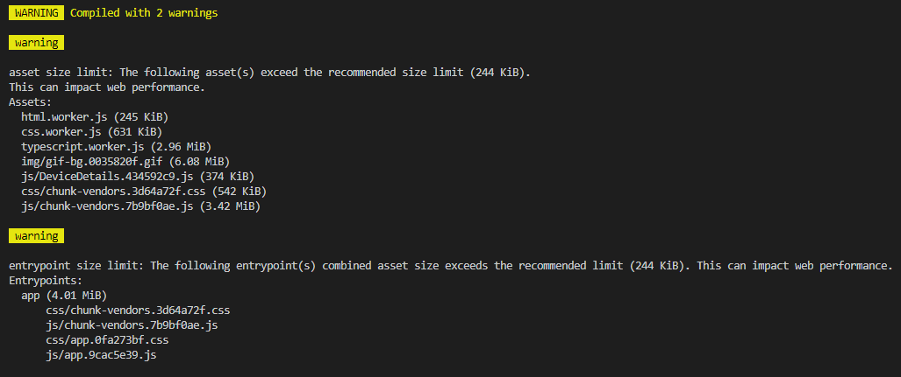
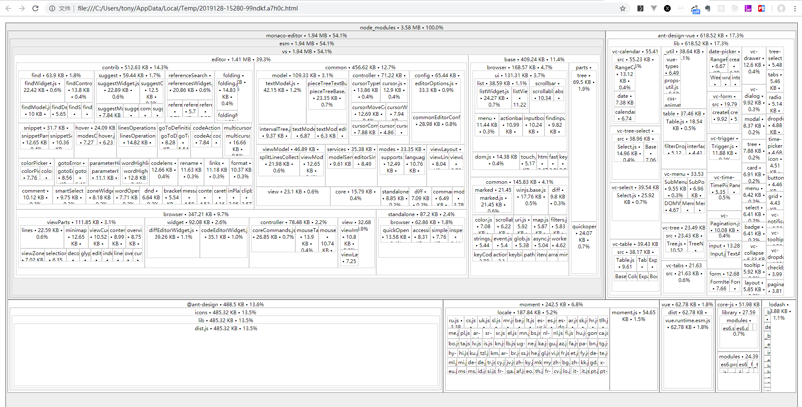

当对项目进行打包时，出现如下提示：

1. 三个worker是为 monaco 编辑器创建的线程，关于worker可以参考阮一峰老师的 [Web Worker 使用教程](http://www.ruanyifeng.com/blog/2018/07/web-worker.html)
2. 有张超大的背景图显然是不合适的，应该替换掉
3. 有个打包的js文件达到了3.42M，下面使用 [source-map-explorer](https://github.com/danvk/source-map-explorer) 来分析一下这个js文件的构成，关于Source Map可以参考阮一峰老师的 [JavaScript Source Map 详解](http://www.ruanyifeng.com/blog/2013/01/javascript_source_map.html)
```
source-map-explorer dist/js/chunk-vendors.7b9bf0ae.js
```

从分析图中可以看出 [monaco-editor](https://github.com/Microsoft/monaco-editor) 占比超过了50%，我们的产品是2B而不是2C的，对于首屏的加载响应要求没有那么高，但因为服务器打包时存在内存溢出的现象，我们这里把 monaco-editor 移出，不经过 webpack 打包处理。  
Vue CLI 官方文档 [处理静态资源](https://cli.vuejs.org/zh/guide/html-and-static-assets.html#%E5%A4%84%E7%90%86%E9%9D%99%E6%80%81%E8%B5%84%E6%BA%90) 部分告诉我们：放置在 public 目录下的资源将会直接被拷贝，而不会经过 webpack 的处理。
参考 [monaco-editor-samples](https://github.com/Microsoft/monaco-editor-samples) 下的 browser-script-editor 对项目做如下调整：
1. 把 node_modules/monaco-editor/min/vs 文件复制到 public 下并修改为 monaco-editor
2. 把 public/index.html 添加monaco-editor资源的引入：
```html
<!DOCTYPE html>
<html lang="en">
  <head>
    <!-- 引入monaco-editor样式文件 -->
    <link rel="stylesheet" data-name="monaco-editor/editor/editor.main" href="./monaco-editor/editor/editor.main.css">
  </head>
  <body>
    <div id="app"></div>
    <!-- 引入monaco-editor脚本文件 -->
    <script src="./config.js"></script>
    <script>var require = { paths: { 'vs': './monaco-editor' } };</script>
    <script src="./monaco-editor/loader.js"></script>
    <script src="./monaco-editor/editor/editor.main.nls.js"></script>
    <script src="./monaco-editor/editor/editor.main.js"></script>
  </body>
</html>
```
3. 把 src/components/CodeEditor.vue 组件中monaco-editor的模块加载方式修改为全局引用
```javascript
// 模块加载
import * as monaco from 'monaco-editor'
let monacoEditor = monaco.editor.create(...)
```
```javascript
// 全局引入
let monacoEditor = window.monaco.editor.create(...)
```