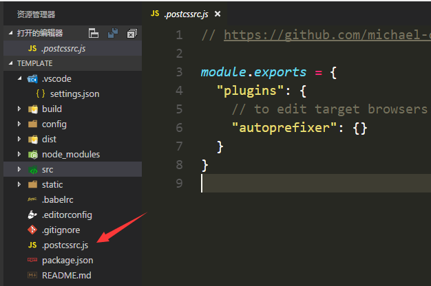

##### 这里以原项目模板的postcss插件autoprefixer为例说明：  


1.为了便于测试，对首页做一些调整：  
增加index.css
```
.postcss_test {
    transform: rotate(3deg);
}
```

修改index.js
```
import './index.css'

//屏蔽掉template属性
new Vue({
  el: '#app',
  router,
  // template: '<App/>',
  components: { App }
})
```

修改index.html
```
<div id="app">
    <app></app>
    <h1 class="postcss_test">postcss-autoprefixer</h1>
</div>
```

2.便于对比，对Hello.vue添加样式
```
<style scoped>
......
h1 {
  transform: rotate(3deg);
}
......
</style>
```

3.分别启动项目查看样式对比和打包后样式对比：  

  
可以看出原模板的postcss插件只对组件起作用，不对页面起作用

4.安装postcss-loader并修改build/utils.js的配置
```
$ npm install postcss-loader -D
```

```
  function generateLoaders (loader, loaderOptions) {
    var loaders = [cssLoader]
    if (loader) {
      ......
      loaders.splice((loaders.length - 1), 0, 'postcss-loader')
    }else {
      loaders.push('postcss-loader')
    }
    ......
  }
```


5.如果需要用到css的预编译，这里以sass为例，安装相应的插件即可：  
```
$ npm install sass-loader node-sass -D
```

6.把index.css改为index.scss并用sass语法写样式，同时修改Hello.vue如下：  
在style标签上添加：lang="scss"
```
<style scoped lang="scss">
......
.hello {
  h1 {
    transform: rotate(3deg);
  }
}
......
</style>
```

7.涉及到vue组件的设置，请参考文档：[vue-loader](http://vue-loader.vuejs.org/en/)，[中文文档]()正在翻译中，敬请期待